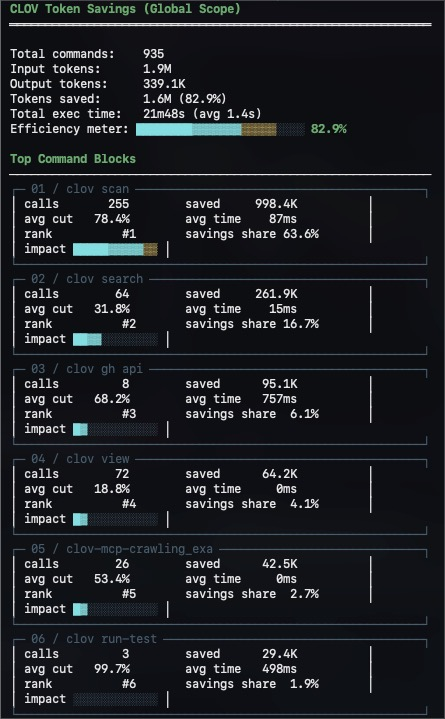

# CLOV - Context Limiter & Output Vetter

<p align="center">
  
</p>

[](https://opensource.org/licenses/MIT)
[](https://github.com/alexandephilia/clov-ai/releases/tag/v0.29.1)
[](https://claude.ai/code)

MCP (Model Context Protocol) servers are brilliant, but their outputs are an uncontrolled firehose of context-destroying noise. When your AI agent pulls web search results or database dumps, it swallows navigation chrome, tracking parameters, and megabytes of unstructured JSON.



`clov` is the apex predator for context bloat. It is a highly specialized, structure-aware JSON-RPC proxy built _specifically_ to intercept and compress MCP responses before they annihilate your LLM's context window.

As a secondary capability, `clov` intercepts raw terminal streams (git, cargo, npm, etc.), mercilessly executing ANSI codes and redundant progress bars.

Deploy `clov` between your AI agent and the world. Reclaim up to **95%** of your context window. Stop paying hyperscalers for garbage tokens.

---

## The Economics of Context


When an AI coder hits an MCP search tool, a single raw response easily spikes over 50,000 tokens. `clov` intercepts, analyzes the structure, and prunes it intelligently.

| Tactical Target                       | Raw Tokens | Filtered via `clov` | Annihilated % |
| ------------------------------------- | ---------- | ------------------- | ------------- |
| **MCP Web Search / Scraping**         | ~65,000    | ~4,500              | **93%**       |
| **MCP Database Connectors**           | ~40,000    | ~5,000              | **87%**       |
| **CLI: Test Suites (`cargo test`)**   | ~25,000    | ~2,500              | **90%**       |
| **CLI: Source Control (`git diff`)**  | ~13,000    | ~3,100              | **76%**       |
| **CLI: Deep Linters (`tsc`, `ruff`)** | ~15,000    | ~3,000              | **80%**       |

_Measured during live AI coding sessions on massive monolithic architectures._

---

## Deployment

Zero friction. Complete control.

```bash
# MacOS / Linux (Homebrew)
brew tap alexandephilia/clov
brew install clov

# Rust Toolchain (Cargo)
cargo install --git https://github.com/alexandephilia/clov-ai

# Direct Injection (Curl)
curl -fsSL https://raw.githubusercontent.com/alexandephilia/clov-ai/refs/heads/main/install.sh | sh
```

_(Pre-compiled binaries for all architectures are available in standard releases)._

---

## MCP Universal Filtering


To armor your MCP servers, wrap their invocation command with the `clov mcp proxy` bridge. `clov` operates as a transparent JSON-RPC layer, handling MCP stdio framing (`Content-Length` and newline-delimited payloads) and compacting both text and structured tool results on the wire.

Configuration example for your AI agent (e.g., `~/.claude/settings.json`):

```json
"mcpServers": {
  "web-search-engine": {
    "command": "clov",
    "args": ["mcp", "proxy", "npx", "-y", "target-mcp-server"]
  },
  "sql-connector": {
    "command": "clov",
    "args": ["mcp", "proxy", "python", "-m", "db_mcp"]
  }
}
```

### The Universal AI Logic:

1. **Dynamic Content Classification**: Identifies web/search payloads, code, structured data, and plain text without server-specific hardcoding.
2. **Aggressive Chrome Stripping**: Removes navigation, footers, ad markers, and other low-signal page chrome from textual payloads.
3. **Structured Data Reduction**: Samples large arrays, keeps high-signal keys, and inserts explicit truncation summaries instead of dumping raw connector output.
4. **Density-Aware Truncation**: Auto-scales truncation limits based on payload density while preserving code shape and useful context.

---

## Standalone CLI Intervention

`clov` doesn't just proxy MCPs. It dominates the terminal. For AI coders like Claude Code, `clov` can inject a global auto-rewrite hook to govern terminal output automatically.

```bash
# Establish global terminal intercept hooks
clov init --global
```

When your AI executes `git log`, `npm test`, or `cargo clippy`, `clov` intercepts the invocation transparently, executing the process, tearing out the ANSI codes, deleting the progress bars, and feeding only pure signal back to the LLM.

### Covered Toolchains:

- **Version Control**: Condenses `git` statuses, tightens PR views (`gh`).
- **Web Stacks**: Mutes `npm`, `pnpm`, `eslint`, `tsc`, `Next.js`, `vitest`.
- **Systems**: Crushes `cargo test`, `cargo build`, `cargo clippy`.
- **Pythonic**: Condenses `pytest`, `ruff`, `mypy`, `pip`.
- **Go**: Strips `go test`, `go build`, `golangci-lint`.
- **DevOps**: Minimizes `docker`, `kubectl` output.

_If `clov` doesn't recognize a command, it bypasses filtering automatically._

---

## Local Telemetry

`clov` tracks your token economy rigorously. No cloud pings. No data theft. 100% local SQLite metrics.

```bash
clov gain             # Lifetime efficiency readouts
clov gain --graph     # 30-day visual velocity charting
clov gain --all       # Granular temporal exports
```

---

## Deep Configuration

`clov` requires no configuration, but command-line veterans can manipulate the tracking database and telemetry environments via `~/.config/clov/config.toml`.

```bash
clov config --create    # Scaffold custom parameters
clov verify             # Validate hook integrity hashes
clov discover           # Scan AI logs for missed optimization vectors
```

### Full-Fidelity Output Recovery (Tee Mode)

If `clov` aggressively intercepts a test failure and the AI actually needs the unadulterated noise to debug, `clov` writes the raw bypass data to a temporary file. A minimal pointer line is provided, allowing the AI to read the full context if—and only if—it is absolutely required.

---

## Technical Index

- [ARCHITECTURE.md](ARCHITECTURE.md) — Universal Filter system design and JSON-RPC proxy internals.
- [CLAUDE.md](CLAUDE.md) — Behavioral guidelines for AI operation.
- [docs/AUDIT_GUIDE.md](docs/AUDIT_GUIDE.md) — Advanced economic charting and localized analytics APIs.

---

## License

MIT License — see [LICENSE](LICENSE).

<p align="center">
  
  <br/><br/>
  <sub>Authored by <a href="https://github.com/alexandephilia">@alexandephilia</a> × claude</sub>
</p>
