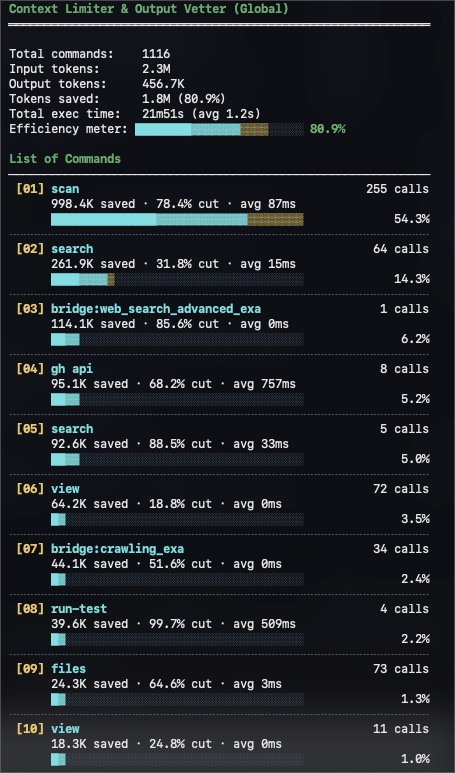
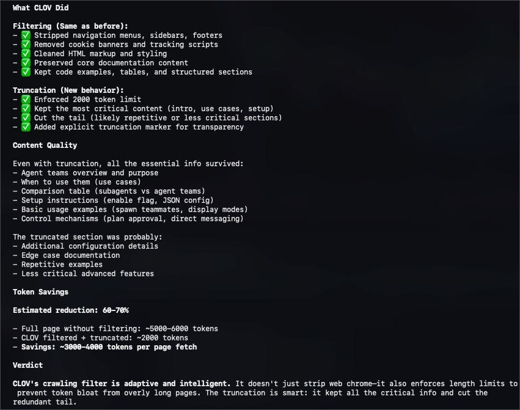

# CLOV - Context Limiter & Output Vetter

_CLOV includes work derived from [RTK](https://github.com/rtk-ai/rtk/), extended with a Rust implementation, deeper MCP proxy support, structured-response filtering, dynamic truncation controls, and a more local-first workflow with filtering and telemetry handled on-device._

<p align="center">
  
</p>

[](https://opensource.org/licenses/MIT)
[](https://github.com/alexandephilia/clov-ai/releases/tag/v0.34.4)
[](https://claude.ai/code)

<p align="center">
  <strong>Quick install</strong><br/>
  <code>brew tap alexandephilia/clov && brew install clov</code>
</p>

> Primary command names now use the CLOV surface (`pulse`, `hook`, `bridge`, `settings`, `doctor`, `inspect`). The old names were removed as part of the CLI migration.

MCP (Model Context Protocol) servers are brilliant, but their outputs are an uncontrolled firehose of context-destroying noise. When your AI agent pulls web search results or database dumps, it swallows navigation chrome, tracking parameters, and megabytes of unstructured JSON.

`clov` is the apex predator for context bloat. It is a highly specialized, structure-aware JSON-RPC proxy built _specifically_ to intercept and compress MCP responses before they annihilate your LLM's context window.

As a secondary capability, `clov` intercepts raw terminal streams (git, cargo, npm, etc.), mercilessly executing ANSI codes and redundant progress bars.

Deploy `clov` between your AI agent and the world. Reclaim up to **95%** of your context window. Stop paying hyperscalers for garbage tokens.

---

## The Economics of Context



When an AI coder hits an MCP search tool, a single raw response easily spikes over 50,000 tokens. `clov` intercepts, analyzes the structure, and prunes it intelligently.

| Tactical Target                       | Raw Tokens | Filtered via `clov` | Annihilated % |
| ------------------------------------- | ---------- | ------------------- | ------------- |
| **MCP Web Search / Scraping**         | ~65,000    | ~4,500              | **93%**       |
| **MCP Database Connectors**           | ~40,000    | ~5,000              | **87%**       |
| **CLI: Test Suites (`cargo test`)**   | ~25,000    | ~2,500              | **90%**       |
| **CLI: Source Control (`git diff`)**  | ~13,000    | ~3,100              | **76%**       |
| **CLI: Deep Linters (`tsc`, `ruff`)** | ~15,000    | ~3,000              | **80%**       |

_Measured during live AI coding sessions on massive monolithic architectures._

---

## Deployment

Zero friction. Complete control.

```bash
# MacOS / Linux (Homebrew)
brew tap alexandephilia/clov
brew install clov

# Rust Toolchain (Cargo)
cargo install --git https://github.com/alexandephilia/clov-ai

# Direct Injection (Curl)
curl -fsSL https://raw.githubusercontent.com/alexandephilia/clov-ai/refs/heads/main/install.sh | sh
```

_(Pre-compiled binaries for all architectures are available in standard releases)._

---

## MCP Universal Filtering



To armor your MCP servers, wrap their invocation command with the `clov bridge proxy` bridge. `clov` operates as a transparent JSON-RPC layer, handling MCP stdio framing (`Content-Length` and newline-delimited payloads) and compacting both text and structured tool results on the wire.


> **Note**: This is a real-world example of `clov` intercepting and filtering Exa search results during an AI coding session.

---

Configuration example for your AI agent (e.g., `~/.mcp.json`):

```json
"mcpServers": {
  "web-search-engine": {
    "command": "/opt/homebrew/bin/clov",
    "args": [
      "bridge",
      "proxy",
      "--preset", "claude-code-balanced",
      "--max-tokens", "4096",
      "--tokenizer-profile", "claude",
      "--max-array-items", "6",
      "--max-object-keys", "16",
      "npx", "-y", "target-mcp-server"
    ]
  },
  "sql-connector": {
    "command": "/opt/homebrew/bin/clov",
    "args": [
      "bridge",
      "proxy",
      "--preset", "gemini-search-heavy",
      "--max-tokens", "6000",
      "--tokenizer-profile", "generic-code",
      "--max-array-items", "10",
      "python", "-m", "db_mcp"
    ]
  }
}
```

Dynamic knobs available on `clov bridge proxy`:

- `--preset <name>`: load named defaults like `claude-code-balanced`, `openai-balanced`, or `gemini-search-heavy`
- `--max-tokens <N>`: target token budget before truncation
- `--tokenizer-profile <profile>`: choose `approx`, `claude`, `openai`, `gemini`, or `generic-code` heuristics for budget enforcement
- `--max-array-items <N>`: keep more or fewer rows before inserting summaries
- `--max-object-keys <N>`: retain more or fewer keys on wide objects
- `--preserve-code <true|false>`: keep code-like payloads intact or force prose-style cleanup
- `--aggressive-chrome-strip <true|false>`: enable or relax nav/footer/ad stripping

The same settings can also be supplied through environment variables for MCP hosts that prefer env-driven config:

- `CLOV_MCP_PRESET`
- `CLOV_MCP_MAX_TOKENS`
- `CLOV_MCP_TOKENIZER_PROFILE`
- `CLOV_MCP_MAX_ARRAY_ITEMS`
- `CLOV_MCP_MAX_OBJECT_KEYS`
- `CLOV_MCP_PRESERVE_CODE`
- `CLOV_MCP_AGGRESSIVE_CHROME_STRIP`

You can also persist defaults in `~/.config/clov/config.toml` under `[mcp]`, for example:

```toml
[mcp]
preset = "claude-code-balanced"
max_tokens = 5000
tokenizer_profile = "claude"
max_array_items = 8
```

### The Universal AI Logic:

1. **Dynamic Content Classification**: Identifies web/search payloads, code, structured data, and plain text without server-specific hardcoding.
2. **Aggressive Chrome Stripping**: Removes navigation, footers, ad markers, and other low-signal page chrome from textual payloads.
3. **Structured Data Reduction**: Samples large arrays, keeps high-signal keys, and inserts explicit truncation summaries instead of dumping raw connector output.
4. **Density-Aware Truncation**: Auto-scales truncation limits based on payload density while preserving code shape and useful context.

---

## Standalone CLI Intervention

`clov` doesn't just proxy MCPs. It dominates the terminal. For AI coders like Claude Code, `clov` can inject a global auto-rewrite hook to govern terminal output automatically.

```bash
# Establish global terminal intercept hooks
clov hook --global
```

When your AI executes `git log`, `npm test`, or `cargo clippy`, `clov` intercepts the invocation transparently, executing the process, tearing out the ANSI codes, deleting the progress bars, and feeding only pure signal back to the LLM.

### Covered Toolchains:

- **Version Control**: Condenses `git` statuses, tightens PR views (`gh`).
- **Web Stacks**: Mutes `npm`, `pnpm`, `eslint`, `tsc`, `Next.js`, `vitest`.
- **Systems**: Crushes `cargo test`, `cargo build`, `cargo clippy`.
- **Pythonic**: Condenses `pytest`, `ruff`, `mypy`, `pip`.
- **Go**: Strips `go test`, `go build`, `golangci-lint`.
- **DevOps**: Minimizes `docker`, `kubectl` output.

_If `clov` doesn't recognize a command, it bypasses filtering automatically._

---

## Local Telemetry

`clov` tracks your token economy rigorously. No cloud pings. No data theft. 100% local SQLite metrics.

```bash
clov pulse             # Lifetime efficiency readouts
clov pulse --graph     # 30-day visual velocity charting
clov pulse --all       # Granular temporal exports
```

---

## Deep Configuration

`clov` requires no configuration, but command-line veterans can manipulate the tracking database and telemetry environments via `~/.config/clov/config.toml`.

```bash
clov settings --create  # Scaffold custom parameters
clov doctor             # Validate hook integrity hashes
clov inspect            # Scan AI logs for missed optimization vectors
```

### Full-Fidelity Output Recovery (Tee Mode)

If `clov` aggressively intercepts a test failure and the AI actually needs the unadulterated noise to debug, `clov` writes the raw bypass data to a temporary file. A minimal pointer line is provided, allowing the AI to read the full context if—and only if—it is absolutely required.

---

## Technical Index

- [ARCHITECTURE.md](ARCHITECTURE.md) — Universal Filter system design and JSON-RPC proxy internals.
- [CLAUDE.md](CLAUDE.md) — Behavioral guidelines for AI operation.
- [docs/AUDIT_GUIDE.md](docs/AUDIT_GUIDE.md) — Advanced economic charting and localized analytics APIs.

---

## Acknowledgments

CLOV includes derivative work based on [rtk-ai/rtk](https://github.com/rtk-ai/rtk), an MIT-licensed project focused on token optimization for AI coding workflows.

This project extends that foundation with a Rust implementation, MCP proxy support, structured-response filtering, dynamic truncation controls, and local telemetry integrations.

Upstream RTK attribution and bundled license text are included in [LICENSES/RTK-MIT-LICENSE](LICENSES/RTK-MIT-LICENSE).

---

## License

MIT License — see [LICENSE](LICENSE).

Third-party attribution and bundled license text for RTK are included in [LICENSES/RTK-MIT-LICENSE](LICENSES/RTK-MIT-LICENSE).

<p align="center">
  
  <br/><br/>
  <sub>Authored by <a href="https://github.com/alexandephilia">@alexandephilia</a> × claude</sub>
  <br/>
  <sub>Includes derivative work and attribution for <a href="https://github.com/rtk-ai/rtk/">rtk-ai/rtk</a> under MIT; see <code>LICENSES/RTK-MIT-LICENSE</code></sub>
</p>
